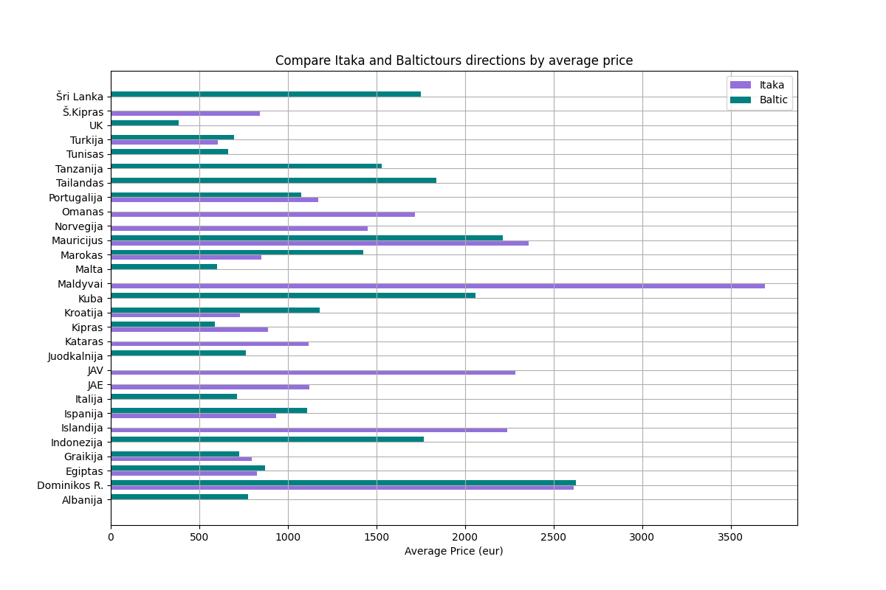

# Itaka and BalticTours travel offers analysis

### Details
**Final project created by:** Gintarė Radavičiūtė and Toma Ivanauskaitė-Samuilė.
  
**Project objective**: analyze and compare travel offers for upcoming spring (2024 March 1st - 2024 May 31st) from Itaka and BalticTours agencies.

### Applied knowledge

**Used libraries:** BeautifulSoup, Requests, Pandas, Matplotlib, SeaBorn, Numpy, Selenium, Webdriver Manager, Time. 

**Baltictours_web_scraping.py**

 - Inspecting the web page : https://www.baltictours.lt/?month=-2&orderby=date&order=desc&taxonomy2&page=1
 - Getting the travel data and adding it to data frame.
 - Transforming and cleaning data.
 - Saving data as CSV file.

**Itaka_web_scraping.py**

 - Inspecting the web page : https://www.itaka.lt/paieskos-rezultatai/?view=offerList&adults=2&date-from=2024-03-01&date-to=2024-05-31&total-price=0&currency=EUR
 - Defining a function for newsletter pup-up.
 - Defining a function for load more button.
 - Defining a function for data scraping.
 - Getting the travel data and adding it to data frame. 
 - Transforming and cleaning data.
 - Saving data as CSV file.

**Final_Analyze.py**

Main project file with all calculations and visualization 

1. Changing island names to country names and country names to country shortens.
2. Grouping data and calculating average prices.
3. Creating visualization to show Itaka and BalticTours travel directions and price comparison. 

4. Counting all travel offers by both agencies and identifying top 5 most offered countries.
5. Creating country and travel offer unit's lists for pie chart visualization.

6. As we find out that in Itaka and BalticTours there are Spain and Greece in top 3. We decide to deeper analyze and compare these travel offers.
7. Calculating separately Spain and Greece travel offers by average price and average duration. After analyze Greece data, we found out that both travel agencies offer almost the same trips on duration and price.
We chose to analyze Spain cities by duration and average price.

8. Grouping Spain offers by cities and calculating correlation between average price and average duration. Showing the correlation in scatter plot visualization.

9. Analyzing and comparing top 5 most expensive travel directions by Itaka and BalticTours. Comparing by average price and average duration.

### Conclusions:

- For upcoming spring Itaka has 317 offers with 19 different directions and
BalticTours has 261 travel offers with 18 different directions. 10 of directions are offered by both travel agencies.
- 24 % of all BalticTours travel offers are to Turkey, this is one dominating direction. Contrary, Itaka travel offers are more diversified. 
- Spain and Greece offers in Itaka occupy up to 29% and in BalticTours up 28% of total offers.  
- Greece travel offers are almost the same in both travel agencies comparing by price and duration.
- Both agencies offer travels to same Spain cities: Barcelona, Tenerife and Mallorca. BalticTours has cheaper  offers based on price and duration. 
- Itaka most expensive travel offer is twice higher comparing with BalticTours. Both travel agencies have offers to Mauritius and Dominican Republic, but the differences on price and duration are significant.
- Itaka offers exotic choices to Maldives, USA, UAE, Oman, Qatar and Island.
- BalticTours offers exotic choices to Sri Lanka, Thailand, Tanzania, Cuba and Indonesia.

